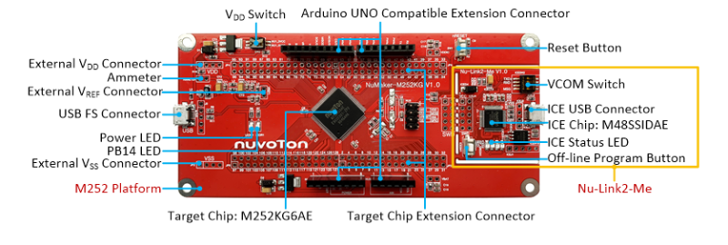

# Automatic Musical Bells

## Summary

The purpose of this project is to create an automatic system for playing songs via a set of handbells. I specifically wanted this system to be able to play as many songs as possible. Having used a variety of digital instruments in the past, I was familiar with MIDI files and the MIDI communication protocol. I wanted to make a device that would appear to be a USB MIDI keyboard to my laptop. This way I can use an off-the-shelf MIDI application to stream any MIDI file downloaded from the internet to this device.

This project was built around the Nuvoton M252 microcontroller and MbedOS. The firmware leveraged MbedOS’s USB Device library stack and setup a USB MIDI device on one of the USB ports. To get this to work, I had to port the Nuvoton USBPhy driver to support the M252 USB Device peripheral.



Nuvoton M252 Board used in this design.
(Image taken from https://www.nuvoton.com/board/numaker-m252kg/).

To strike each bell, I settled on using a simple solution of using a solenoid fixed in a position. The fixture was 3D-printed along with a secondary fitting that was used to secure the bell handle to mount. Each solenoid is driven by 12V via a mosfet driver and is activated by the main controller.


After writing the software, tuning the timing of the pulses for the solenoids, 3D printing the holders, wiring up the bells, and placing in an enclosure, the system was ready for some testing. The below video is of the bells palying the song “Imagine”. Listen carefully and you can make out the tune!


Musical bells playing “Imagine”.

The range of music that this system is capable of playing is severly limited by the fact that it is only one octave with no sharps or flats. Additionally, there is currently no way to adjust the volume of any given note.

I have many improvements in mind and will update when they are ready!

## Build

You can build the project using the mbed cli.

```bash
mbed compile
```
